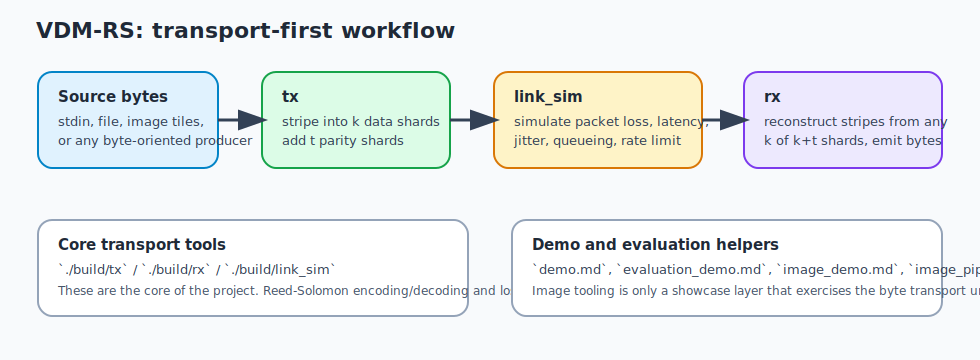

# VDM-RS

Vandermonde matrix-based Reed-Solomon forward error correction library

Read `plan.md` for what's left to implement.

See `demo.md` for the UDP stream demo, `evaluation_demo.md` for the automated
evaluation/visualization workflow, and
[docs/image_transport.md](docs/image_transport.md) for the image transport demo
and comparison workflows.

See [piazza](https://piazza.com/class/mjzz4wzsihz3kg/post/86) for grading criteria.

## Overview

The core of this project is the transport path:

- `tx`: Reed-Solomon encoding and UDP packetization
- `link_sim`: packet loss / latency / jitter / queue simulation
- `rx`: Reed-Solomon decoding and byte-stream recovery

The image workflows are only demonstrations of the transport. They exist to show
how the encoding/decoding path behaves under packet loss on a human-readable
payload, but the main contribution is still the byte transport and recovery
pipeline.



## Tools

- Core transport: `./build/tx`, `./build/rx`, `./build/link_sim`
- Unit tests: `./build/unit_tests`
- Stream demo: `demo.md`
- Stream evaluation: `evaluation_demo.md`
- Image transport demo and comparison: `docs/image_transport.md`


## Environment Setup

This repo contains git submodules. Clone using:
```bash
git clone --recurse-submodules <repo_url>
```

Do __NOT__ install the C/C++ vscode extension from Microsoft (`ms-vscode.cpptools`).

Install the `clangd` extension instead (`llvm-vs-code-extensions.vscode-clangd`).

```bash
brew update

# MUST READ the info that brew prints, to ensure you'll be using the
# brew-installed tools, NOT the older tools that came with macOS.
brew install llvm clang-format make cmake

clang --version  # Should be >=22.x
cmake --version  # Should be >=4.x
gmake --version  # Should be >=4.x
```

## Build

```bash
mkdir build
cmake -B build
cmake --build build
./build/unit_tests
```


## Misc

- Set `editor.formatOnSave` to `true` in vscode settings
- Run `./format-code.sh` prior to commits
